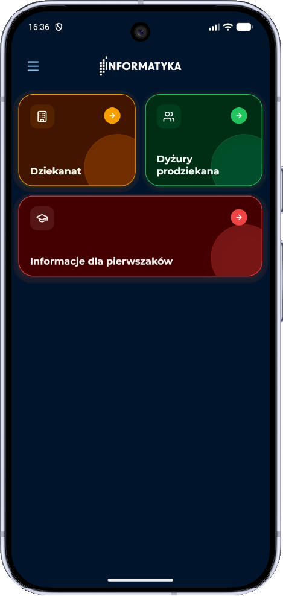
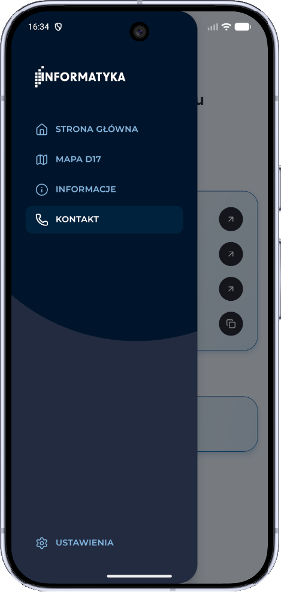
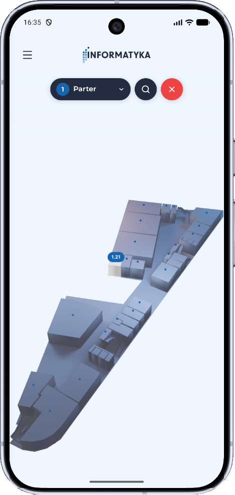
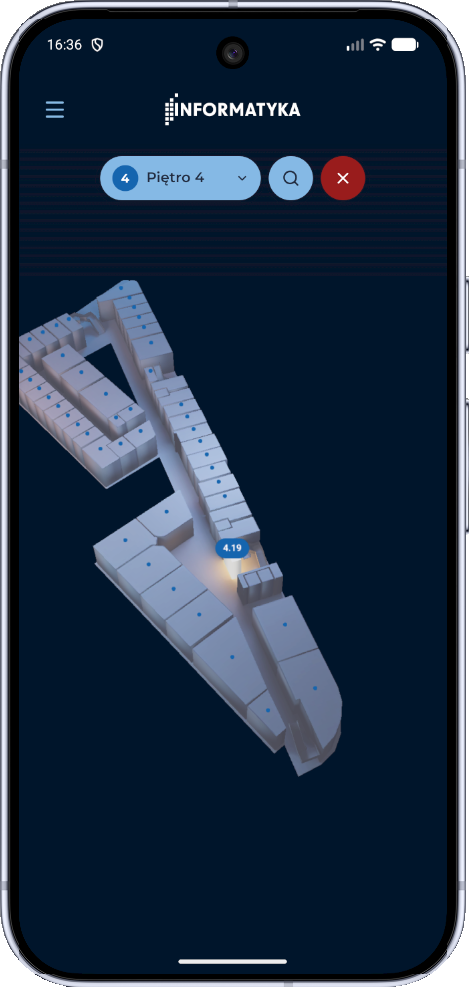
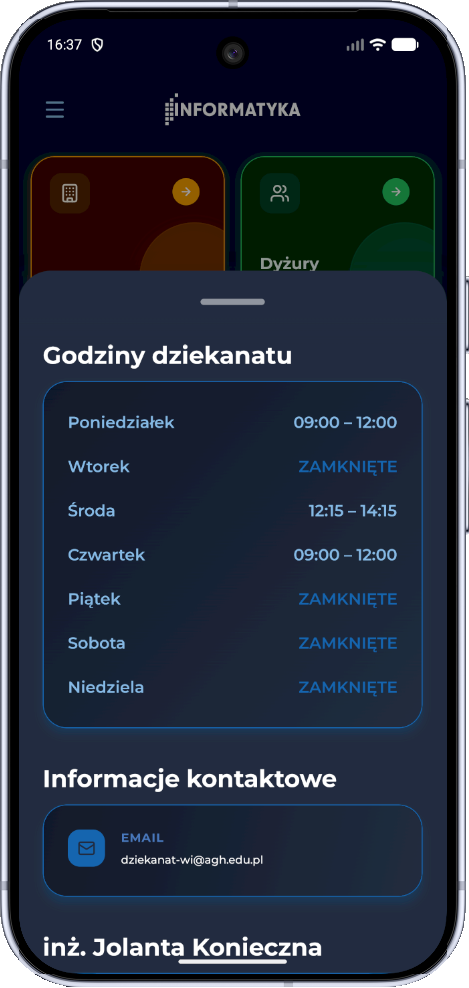

# MyD17


MyD17 is a mobile application for the Faculty of Computer Science, designed to support the faculty's promotion and communication efforts. It provides students and visitors with access to news and events, a 3D interactive map of the D17 building, dean's office hours, contact information, and first-year student resources. Content is managed through a dedicated CMS application. The project was developed as part of the Inżynieria Oprogramowania (Software Engineering) course.

Built as a monorepo with a React Native (Expo) mobile frontend and a Strapi CMS backend, using Turborepo for build orchestration and Docker Compose for local development.

The Android APK is available for download from the [Releases](../../releases) page.

> **Note:** The released APK is built with the backend URL set to `http://10.0.2.2:1337` (Android emulator localhost). To use it on a physical device, you need to build the app manually with your own `EXPO_PUBLIC_STRAPI_URL`.

<table>
  <tr>
    <td align="center"><br/><sub>Home - light mode</sub></td>
    <td align="center"><br/><sub>Home - dark mode</sub></td>
    <td align="center"><br/><sub>Navigation drawer</sub></td>
    <td align="center"><br/><sub>News & events feed</sub></td>
  </tr>
  <tr>
    <td align="center"><br/><sub>3D map - ground floor</sub></td>
    <td align="center"><br/><sub>3D map - 4th floor (dark)</sub></td>
    <td align="center"><br/><sub>Dean's office hours & contact</sub></td>
    <td></td>
  </tr>
</table>

---

## Self-Hosted Deployment
### System requirements

|  | Minimum | Recommended |
|---|---|---|
| Processor | x64, 1.4 GHz | x64, 2 GHz dual core |
| Memory | 2 GB RAM | 4 GB RAM |
| Storage | 12 GB | 25 GB |
| Docker | Engine 26+ with Compose plugin | Engine 26+ with Compose plugin |

### Installation

**1. Install Docker Engine** following the [official guide](https://docs.docker.com/engine/install/#supported-platforms).

**2. Download deployment files** to the server:

```bash
curl -Lso myd17.sh https://github.com/pandetthe/MyD17/releases/latest/download/myd17.sh
chmod +x myd17.sh
```

`compose.yaml` is downloaded automatically by the installer in the next step.

**3. Run the installer** - prompts for domain name, optional managed PostgreSQL, nginx reverse proxy, SSL, and content preview:

```bash
./myd17.sh install
```

This generates `.env` with all secrets. Store a secure copy before proceeding.

**4. Pull the Strapi image** from GHCR (requires a GitHub personal access token with `read:packages`):

```bash
echo YOUR_GITHUB_TOKEN | docker login ghcr.io -u YOUR_GITHUB_USERNAME --password-stdin
```

Then set the image tag in `.env`:

```dotenv
MYD17_VERSION=1.2.0
```

**5. Start the stack:**

```bash
./myd17.sh start
```

For updates, rollbacks, backups, diagnostics, and the full script reference see [docs/on-premise.md](docs/on-premise.md).

---

For local development setup see [docs/development.md](docs/development.md).
For the full documentation index see [docs/README.md](docs/README.md).
